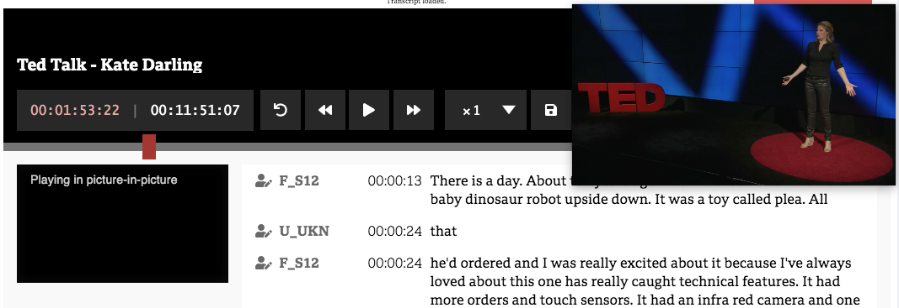

### Item to test #1: Player Controls

#### Item to test #1.1: Player Controls - Btns

From left to right 

| item | Buttons      |  Steps        | Expected Results   |
|---|---           |---            |---                 |
| 1.1.1 |current time  | display       | display current time of media, updates while playing  |
| 1.1.2 |current time  | click         | triggers prompt to jump to set time, using custom formats options  |
| 1.1.3|Duration      | display       | display duration of media    |
| 1.1.4 |RollBack      | click         | To rewind of a set amount, 15 sec default  |
| 1.1.5 |rewind        | click         | Rewind 10 sec  |
| 1.1.6 |rewind        | click - hold  | Continue to rewind until release of btn  |
| 1.1.7 |play          | click         | play media, audio or video  |
| 1.1.8 |fast forward  | click         | Fast forward 10 sec   |
| 1.1.9 |fast forward  | click - hold  | Continue to fast forward until release of btn  |
| 1.1.10 |Playback speed | click - select| change the playback speed, of amount from dropdown  |
| 1.1.12|Save      | click on 💾       | should save content to local storage    |
| 1.1.13|'Picture in Picture'  📺    | click       | hide or show video as separate window always on top   |
| 1.1.14|Volume        | click - Toggle| Mutes and un-mutes media   |

#### Item to test #1.2: Player Controls - Preview

##### Steps:
- [ ] Click on the media preview on the left
##### Expected Results: 
- [ ] if media paused expect to start playing
- [ ] if media playing expect to pause playing

#### Item to test #1.3: Player Controls - Progress Bar

##### Steps:
- Click inside the progress bar

##### Expected Results: 
- [ ] Expect the progress bar play head to change to clicked point
- [ ] Expect current time  display in player controls to update accordingly
- [ ] If media was paused, expect media to start playing
- [ ] Expect the editor to jump to the current word below

#### Item to test #1.4: Player Controls - 'Picture in Picture'

##### Steps:
- [ ] Click the 'Picture in Picture' icon 📺

##### Expected Results: 
- [ ] If video, expect the video to appear as resizable floating window always on top
- [ ] Expect if click picture in picture icon again for video to go back to it's original place
- [ ] if in chrome expect it to work
- [ ] if in browser other then chrome (Safari, Firefox etc) expect to get warning message saying browser is not supported and to use in chrome instead.

#### Item to test #1.11: Player Controls - Save  💾 

##### Steps:
- [ ] edit some text
- [ ] Click the 'Save' icon 📺
- [ ] refresh browser
##### Expected Results: 
- [ ] Expect the text to persist after refresh