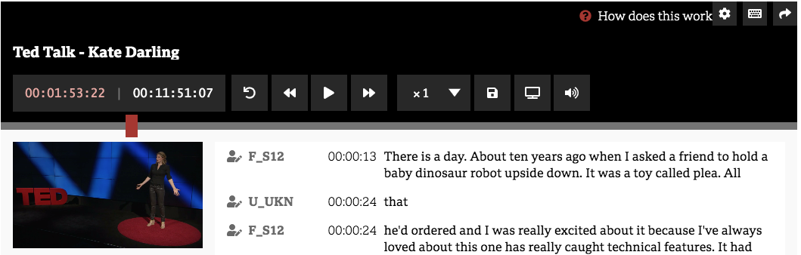
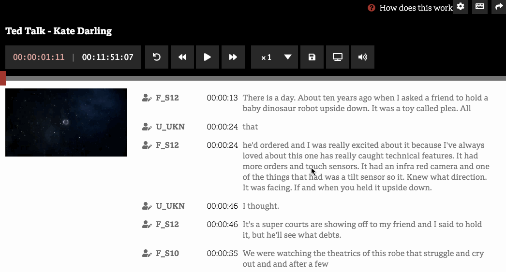

# QA Test Plan: React Transcript Editor

Last updated: _3rd Jan 2018_     
version: _>=0.2.0_

This doc provides a lightweight set of steps and checklists for manual QA test. This should be done before every major release.

_The assumption underlying this doc is that anyone, even without technical skills, should be able to conduct QA testing._

## Overview
React Transcript Editor it's a react component, to make transcribing audio and video easier and faster. Please see project repository the Github [README](https://github.com/bbc/react-transcript-editor/blob/master/README.md) page,for an overview of what the component does and how it works (https://github.com/bbc/react-transcript-editor). 

<!-- Here is a video demo of the  main use case: https://youtu.be/4z143-nJlzs.  -->

## Where to test:
<!-- _URL of where testing should be performed (staging, sandbox)_ -->

The app can be tested using the demo application at 
https://bbc.github.io/react-transcript-editor/

For updating the the demo app with latest version of the component [see these instructions](https://github.com/bbc/react-transcript-editor#build---demo)

## Where to log bugs: 
<!-- _Provide link to Fogbugz, Github, Trello, etc. Also include to whom the bugs should be assigned (if applicable)._ -->

If you find any bugs or issues, please [open an issue in Github](https://github.com/bbc/react-transcript-editor/issues/new?template=bug_report.md) and assign it to [@pietrop](https://github.com/pietrop).

If it's connect to one or more of the QA steps listed below make a note of the corresponding number.

For things like typos feel free to directly do a PR with the changes.

## Browsers/devices: 
By default we aim for the component to work on the latest major version of the following browsers on the below devices.

Desktop (Mac, Win and Linux), Tablet (iOS, Android, Win), Mobile (iOS, Android, Win), on Chrome, Firefox, Safari, Internet Explorer and Edge.

When you raise an issue please indicate the operating system, device, and browser.

---

## Items to test

There are 5 main parts for QA testing

1. Player Controls
2. Timed Text Editor 
3. Settings
4. Keyboard Shortcuts
5. Analytics

### Item to test #1: Player Controls

#### Item to test #1.1: Player Controls - Btns

<!-- 
#### Steps:
- 
#### Expected Results: 
-  
-->

From left to right 

| item | Buttons      |  Steps        | Expected Results   |
|---|---           |---            |---                 |
| 1.1.1 |RollBack      | click         | To rewind of a set amount, 15 sec default  |
| 1.1.2 |rewind        | click         | Rewind 10 sec  |
| 1.1.3 |rewind        | click - hold  | Continue to rewind until release of btn  |
| 1.1.4 |play          | click         | play media, audio or video  |
| 1.1.5 |fast forward  | click         | Fast forward 10 sec   |
| 1.1.6 |fast forward  | click - hold  | Continue to fast forward until release of btn  |
| 1.1.7 |Playback rate | click - select| change the playback rate, of amount from dropdown  |
| 1.1.8 |current time  | display       | display current time of media, updates while playing  |
| 1.1.9 |current time  | click         | triggers prompt to jump to set time, using custom formats options  |
| 1.1.10|Duration      | display       | display duration of media    |
| 1.1.11|Volume        | click - Toggle| Mutes and un-mutes media   |

#### Item to test #1.2: Player Controls - Preview

##### Steps:
- Click on the media preview on the left
##### Expected Results: 
- [ ] if media paused expect to start playing
- [ ] if media playing expect to pause playing

#### Item to test #1.3: Player Controls - Progress Bar

##### Steps:
- Click inside the progress bar

##### Expected Results: 
- [ ] Expect the progress bar play head to change to clicked point
- [ ] Expect current time  display in player controls to update accordingly
- [ ] If media was paused, expect media to start playing

---

### Item to test #2: Timed Text Editor 

#### Item to test #2.1: Timed Text Editor - double click on words

##### Steps:
- Double click on a word
##### Expected Results: 
- [ ] Expect play head and current time it to jump to the corresponding point in the media
- [ ] Expect the text before the word to be darker color 
- [ ] Expect current word to be highlighted
- [ ] Expect media to start playing and highlight and current word to continue

#### Item to test #2.2: Timed Text Editor - click on timecodes

##### Steps:
- Click on timecode next to the text of the paragraph
##### Expected Results: 
-  [ ] Expect play head and current time it to jump to the corresponding point in the media beginning of paragraph 
<!-- 
Similar to above - expect same behaviour so perhaps not worth testing gain?
- [ ] Expect the text before the word to be darker color 
- [ ] Expect current word to be highlighted
- [ ] Expect media to start playing and highlight and current word to continue
 -->

#### Item to test #2.3: Timed Text Editor - Edit speakers labels

#### Steps:
- click on speaker icon next to default speaker names
#### Expected Results: 
-  [ ] Expect a prompt to come up, 
    - [ ] on add text and click on expect name to change in Timed Text Editor next to speaker label icon clicked.
- [ ] if instead of ok click cancel, expect nothing to happen

---

### Item to test #3: Settings

#### Item to test #3.1: Settings - show

##### Steps:
- click on settings, cog  icon top left
##### Expected Results: 
-  Expect settings panel to come up 

#### Item to test #3.2: Settings - hide

##### Steps:
- click on settings panel cross, top right
##### Expected Results: 
-  Expect settings panel to hide

#### Item to test #3.3: Settings - pause while typing - on

##### Steps:
- click settings icon top left
- in settings panel, click toggle for "pause while typing" to be on
- in TimedTextEditor double click on a word, media starts playing
- start typing to correct a word
#### #Expected Results: 
- [ ] Expect media to pause while typing
- [ ] Expect media to re-start a few seconds after stopped typing

#### Item to test #3.4: Settings - pause while typing - off

##### Steps:
- click settings icon top left
- in settings panel, click toggle for "pause while typing" to be off
- in TimedTextEditor double click on a word, media starts playing
- start typing to correct a word
##### Expected Results: 
- [ ] Expect media not to pause while typing, and continue playing

#### Item to test #3.5: Settings - scroll sync - on
scroll into view 

##### Steps:
- click settings icon top left
- in settings panel, click toggle for "scroll sync" to be on 
- in TimedTextEditor click on progress bar, further away from current playhead
##### Expected Results: 
- [ ] Expect text in timed text editor in view to jump to corresponding current time

#### Item to test #3.6: Settings - scroll sync - off

##### Steps:
- click settings icon top left
- in settings panel, click toggle for "scroll sync" to be off 
- in TimedTextEditor click on progress bar, further away from current playhead
##### Expected Results: 
- [ ] Expect text in timed text editor in view not to jump to corresponding current time

#### Item to test #3.7: Settings - set roll back interval

##### Steps:
- click settings icon top left
- in settings panel, change value of 'Rollback Interval (sec)', something other then default 15 seconds
- Make sure media current time is not zero
- Click on roll back btn 
##### Expected Results: 
-  Expect current time to roll back by the the custom ammount set in previous steps
- Expect progress bar, media preview, and timed text editor words hilight to update accordingly

#### Item to test #3.8: Settings - Show/hide timecodes - off

##### Steps:
- click settings icon top left
- in settings panel, toggle 'Show Timecodes' to be off
##### Expected Results: 
-  Expect timecodes to disappear in timed text editor

####  Item to test #3.9: Settings - Show/hide timecodes - on

##### Steps:
- click settings icon top left
- in settings panel, toggle 'Show Timecodes' to be on
##### Expected Results: 
-  Expect timecodes to appear in timed text editor

#### Item to test #3.10: Settings - Show/hide speaker labels -off

##### Steps:
- click settings icon top left
- in settings panel, toggle 'Show Speaker Labels' to be off
##### Expected Results: 
-  Expect speaker labels to disappear in timed text editor

#### Item to test #3.11: Settings - Show/hide speaker labels -on

#### Steps:
- click settings icon top left
- in settings panel, toggle 'Show Speaker Labels' to be on
#### Expected Results: 
-  Expect speaker labels to appear in timed text editor

#### Item to test #3.12: Settings - Set timcode offset - set

##### Steps:
- click settings icon top left
- in settings panel, change the 'Timecode Offset ' from default `00:00:00:00` eg to `01:00:00:00`
- click save
- close settings panel, clicking top right cross 
##### Expected Results: 
- [ ] Expect timecode offset to added to current time, eg if progress bar is at beginning should see `01:00:00:00`
- [ ] Expect timecode offset to added to duration
- [ ] Expect timecode offset to added to timecodes at paragraph level (Show Timecodes needs to be on to inspect this)

#### Item to test #3.13 Settings - Set timcode offset - reset

##### Steps:
-  follow setup steps of previous 'Settings - Set timcode offset - set'
-  then click 'reset'
##### Expected Results: 
- [ ] Expect timecode offset to be removed from current time, eg if progress bar is at beginning should see `00:00:00:00`
- [ ] Expect timecode offset to removed to duration
- [ ] Expect timecode offset to be removed from timecodes at paragraph level (Show Timecodes needs to be on to inspect this)

---

### Item to test #4: Keyboard Shortcuts

#### Item to test #4.1:Keyboard Shortcuts - show

##### Steps:
- click on keyboard shortcut,  icon top left
##### Expected Results: 
-  Expect keyboard shortcut panel to come up 

#### Item to test #4.2: Keyboard Shortcuts - hide

##### Steps:
- click on keyboard shortcut panel cross, top right
##### Expected Results: 
-  Expect keyboard shortcut panel to hide

#### Item to test #4.3: Keyboard Shortcuts 

| n | Functionality      |  Steps        | Expected Results   |
|---|---           |---            |---                 |
| 1 |Play Media    | click keyboard shortcut combination | to play/pause media
| 2 | set current time   | click keyboard shortcut combination | to prompt change current time dialog
| 3 | Fast Forward  | click keyboard shortcut combination | To fast forward media 
| 4 | Rewind  | click keyboard shortcut combination | to rewind media
| 5 |  Increase playback rate  | click keyboard shortcut combination | to Increase playback rate  of the media, and show current playback rate in playback rate btn
| 6 |  Decrease playback rate  | click keyboard shortcut combination | to Decrease playback rate of the media, and show current playback rate in playback rate btn
| 6 |  RollBack  | click keyboard shortcut combination | to RollBack playhead default amount of 15 sec, or custom amount set in settings

---

### Item to test #5: Analytics

Analytics in[the demo app](https://bbc.github.io/react-transcript-editor/) are logged in a text area below the component for demonstration purposes.
This can also be used to test tha they are fulling working.

Every new event return an object into an array in the text area. 
Inspecting the array for new elements gives a good indication of whether all expected events are being tracked. eg if an event is not in the array list then the code might not be working as expected.

Here's a list of events grouped by functionality. It might be easier to test one at a time, or if already done the test for above items, can just review the array generated so far to see if any of these are missing.

##### info
- [ ] duration of media
- [ ] number of words in transcript

_these we'd expect to be triggered first_

##### actions
- [ ] click on progress bar
- [ ] double click on word // now also triggered when  clicking on time-codes
- [ ] click on time-codes, at paragraph level
- [ ] Jump to time, click on current time display 
- [ ] play/pause, click on media preview // but triggered by other events as well
- [ ] use of keyboard shortcuts // see keyboard shortcut cheat sheet and test each individually
- [ ] edit speaker label 
- [ ] ~skip forward~
- [ ] ~skip backward~

##### settings
- [ ] set timecode offset
- [ ] pause while typing
- [ ] scroll into view
- [ ] playback rate change
- [ ] rollback 
- [ ] Toggles speaker names - show/hide 

